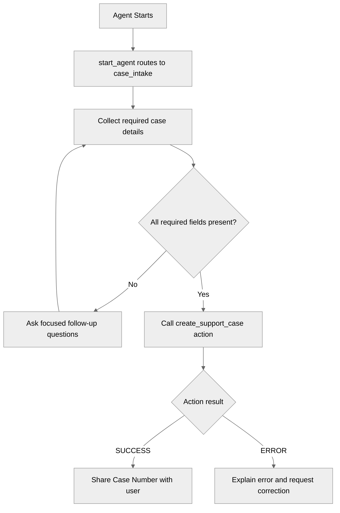

# CaseCreationAgent

## Overview

This recipe demonstrates how to build an Agent Script agent that creates Salesforce `Case` records after collecting all required support details.

The agent uses an Apex invocable action (`apex://CaseCreationService`) to insert case records and return the created case Id and Case Number.

## Agent Flow



## Key Concepts

- Action target uses Apex: `target: "apex://CaseCreationService"`
- Required detail collection before action call
- Action input slot-filling with `with field=...`
- Action output handling with `set @variables.last_case_number = @outputs.caseNumber`
- Bulk-safe Apex service for creating one or more case records

## Required Details Collected

The agent gathers these values before attempting case creation:

- `customerName`
- `customerEmail`
- `subject`
- `description`
- `status`
- `origin`
- `priority`

`customerPhone` is optional.

## Files in This Recipe

- `aiAuthoringBundles/CaseCreationAgent/CaseCreationAgent.agent`
- `aiAuthoringBundles/CaseCreationAgent/CaseCreationAgent.bundle-meta.xml`
- `classes/CaseCreationService.cls`
- `classes/CaseCreationServiceTest.cls`

## Try It Out

Example conversation:

```text
Agent: Hi! I can help you create a support case. Share the issue and I will collect the required details.

User: I cannot log in to my account.

Agent: I can help with that. Please share:
       1) Your full name
       2) Email
       3) A short subject
       4) A detailed description
       5) Status, origin, and priority you want on the case

User: Name is Alicia Smith, email is alicia.smith@example.com, subject is Login issue,
      description is I cannot log in after password reset, status New, origin Web, priority High.

[Agent calls create_support_case]

Agent: Your case has been created successfully. Case Number: 00001024.
```

## Testing

Run `CaseCreationServiceTest` to verify:

- Successful case insertion and response output mapping
- Clear error responses when required inputs are missing

## What's Next

- Extend the agent with `after_reasoning` to normalize status/origin/priority values.
- Add optional account/contact lookup before case creation.
- Add callback actions for acknowledgement email or escalation workflows.
